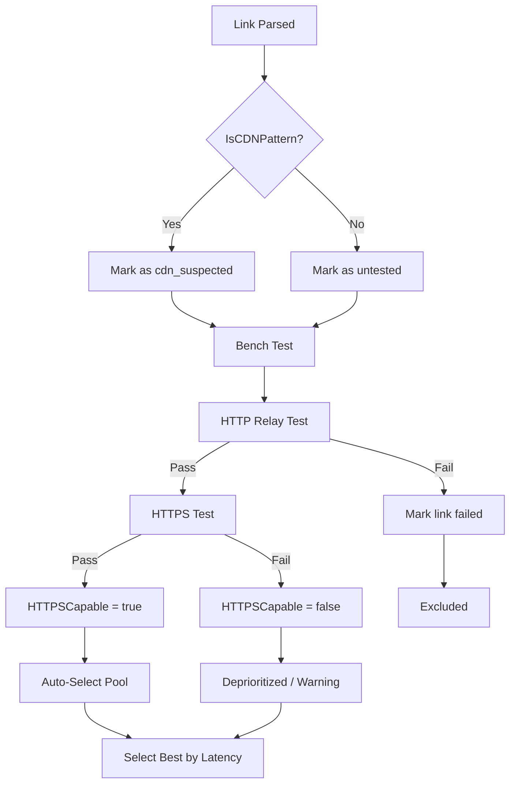

# Design Document: CDN HTTPS Detection

## Overview

This feature adds CDN-pattern link detection and HTTPS connectivity testing to Bypath. The core problem is that CDN-based proxy links (Cloudflare Workers on port 443 with WebSocket transport) can only relay HTTP traffic — they terminate TLS at the CDN edge and the worker only sees plaintext HTTP. These links pass current bench tests (which use HTTP URLs) but fail for real HTTPS browsing.

The solution has three layers:
1. **Static detection** — A heuristic function that identifies CDN-pattern links by their configuration fields
2. **Dynamic verification** — An HTTPS connectivity test during bench that confirms whether a link can actually relay HTTPS
3. **User-facing integration** — Warnings in CLI/TUI and HTTPS-aware auto-selection

## Architecture



The detection function lives in `internal/profile/` alongside the Link struct. The HTTPS test integrates into the existing bench flow in both `cmd/bypath/main.go` (CLI bench) and `internal/tui/bench.go` (TUI bench). No new packages are needed.

## Components and Interfaces

### 1. CDN Detection Function

**Location:** `internal/profile/cdn.go`

```go
// IsCDNPattern checks if a link's configuration matches the CDN relay pattern.
// CDN links have: port 443, WebSocket transport, TLS enabled, and a host field
// that differs from the address (indicating CDN fronting).
func IsCDNPattern(link *Link) bool {
    // Reality connections are direct, not CDN
    if link.Security == "reality" {
        return false
    }
    // Must be port 443 + ws + TLS
    if link.Port != 443 || link.Network != "ws" || !link.TLS {
        return false
    }
    // Host must be set and differ from address (CDN fronting indicator)
    if link.Host == "" || link.Host == link.Address {
        return false
    }
    return true
}
```

### 2. HTTPS Connectivity Test

**Location:** `internal/profile/https_test_func.go` (to avoid collision with `_test.go` convention, name it `httpscheck.go`)

```go
// TestHTTPS checks if a proxy can relay HTTPS traffic.
// It curls an HTTPS endpoint through the given SOCKS proxy port.
// Returns true if the HTTPS request succeeds.
func TestHTTPS(ctx context.Context, proxyPort int) bool {
    testCtx, cancel := context.WithTimeout(ctx, 8*time.Second)
    defer cancel()
    
    cmd := exec.CommandContext(testCtx, "curl", "-s",
        "-x", fmt.Sprintf("socks5h://127.0.0.1:%d", proxyPort),
        "--connect-timeout", "6",
        "-o", "/dev/null",
        "-w", "%{http_code}",
        "https://cp.cloudflare.com")
    out, err := cmd.Output()
    if err != nil {
        return false
    }
    code := strings.TrimSpace(string(out))
    return code == "200" || code == "204"
}
```

### 3. Link Struct Extension

**Location:** `internal/profile/profile.go`

Add a new field to the Link struct and a helper for the HTTPS status.

### 4. Bench Integration

The existing `benchLinkOnPort` (CLI) and `testRelay`/`runParallelBench` (TUI) functions are extended to call `TestHTTPS` after a successful HTTP relay test. The HTTPS result is stored in the bench result struct and displayed.

### 5. Warning Display

- **CLI bench:** Add an "HTTPS" column to the results table showing ✓/✗/—
- **CLI select:** Print a warning line when selecting an HTTPS-incapable link
- **TUI bench:** Add an HTTPS column; color HTTPS-failed links differently
- **CLI list:** Show `[CDN]` tag next to links detected as CDN pattern

## Data Models

### Link Struct Extension

```go
type Link struct {
    // ... existing fields ...
    
    // HTTPSCapable indicates HTTPS relay capability:
    //   0 = untested (default zero value)
    //   1 = passed HTTPS test
    //  -1 = failed HTTPS test
    HTTPSCapable int `json:"https_capable,omitempty"`
    
    // CDNDetected indicates the static heuristic flagged this as a CDN link.
    // This is computed, not persisted (use json:"-" or omitempty with recompute on load).
    CDNDetected bool `json:"-"`
}
```

**Design Decision:** `HTTPSCapable` uses an int tri-state (0/1/-1) rather than a bool pointer or separate enum to keep JSON serialization simple and the zero value meaningful ("untested"). The `CDNDetected` field is computed at runtime from link fields and not persisted — it's re-evaluated on load via `IsCDNPattern()`.

### Bench Result Extension

```go
// In cmd/bypath/main.go and internal/tui/bench.go
type benchResult struct {
    // ... existing fields ...
    httpsOk bool // true if HTTPS test passed
}

// TUI benchEntry extension
type benchEntry struct {
    // ... existing fields ...
    https int // 1=ok, 0=not tested, -1=failed
}
```

## Correctness Properties

*A property is a characteristic or behavior that should hold true across all valid executions of a system — essentially, a formal statement about what the system should do. Properties serve as the bridge between human-readable specifications and machine-verifiable correctness guarantees.*

### Property 1: CDN detection is deterministic and consistent

*For any* Link struct, calling `IsCDNPattern` multiple times with the same field values SHALL always return the same boolean result.

**Validates: Requirements 1.5**

### Property 2: Reality links are never classified as CDN

*For any* Link with Security == "reality", `IsCDNPattern` SHALL return false regardless of port, network, TLS, or host values.

**Validates: Requirements 1.3**

### Property 3: Non-WebSocket links are never classified as CDN

*For any* Link with Network != "ws" (e.g., "tcp", "grpc", "h2"), `IsCDNPattern` SHALL return false regardless of port, TLS, or host values.

**Validates: Requirements 1.4**

### Property 4: CDN classification requires all four conditions

*For any* Link, `IsCDNPattern` returns true if and only if: port == 443 AND network == "ws" AND TLS == true AND host != "" AND host != address AND security != "reality".

**Validates: Requirements 1.1, 1.2**

### Property 5: HTTPS-capable links are preferred in auto-select

*For any* set of bench results where at least one link is HTTPS-capable, the auto-selected link SHALL be HTTPS-capable (even if a non-HTTPS link has lower latency).

**Validates: Requirements 5.1, 5.2**

### Property 6: Auto-select falls back when no HTTPS links exist

*For any* set of bench results where no link is HTTPS-capable but at least one link passed the HTTP relay test, the auto-selected link SHALL be the one with the lowest latency among passing links.

**Validates: Requirements 5.3**

## Error Handling

| Scenario | Handling |
|----------|----------|
| HTTPS test times out (8s) | Mark link as HTTPS-incapable, continue bench |
| curl not found on system | Skip HTTPS test, log warning, mark as untested |
| sing-box fails to start for a link | Mark both HTTP and HTTPS as failed |
| All links fail HTTPS test | Auto-select falls back to fastest HTTP link + warning |
| Link has empty/invalid address | Skip from bench entirely (existing behavior) |
| HTTPS test endpoint is unreachable | Treat as test failure for that link (not a system error) |

Error messages follow existing conventions with emoji prefixes:
- `⚠️  No HTTPS-capable links found — selected fastest HTTP link`
- `⚠️  Link '%s' is CDN-based and may not support HTTPS browsing`

## Testing Strategy

### Unit Tests

- `TestIsCDNPattern`: Table-driven tests covering all combinations of port/network/TLS/host/security
- `TestIsCDNPattern_EdgeCases`: Empty host, host == address, non-standard ports, reality security

### Property-Based Tests

Using Go's `testing/quick` package (stdlib) or `pgregory.net/rapid`:

- **Property 4** test: Generate random Link structs, verify `IsCDNPattern` output matches the conjunction of all four conditions
- **Property 2** test: Generate random Links with Security="reality", verify always returns false
- **Property 3** test: Generate random Links with Network∈{"tcp","grpc","h2"}, verify always returns false
- **Property 5** test: Generate random bench result sets with mixed HTTPS capability, verify auto-select picks HTTPS-capable
- **Property 6** test: Generate bench result sets with no HTTPS-capable links, verify fallback to lowest latency

**Configuration:**
- Minimum 100 iterations per property test
- Use `pgregory.net/rapid` for structured generators (Link struct generation)
- Tag format: `// Feature: cdn-https-detection, Property N: <title>`

### Integration Tests

- End-to-end bench with a known CDN link (manual/CI with mock)
- Verify CLI output format includes HTTPS column
- Verify TUI bench entry includes HTTPS status
