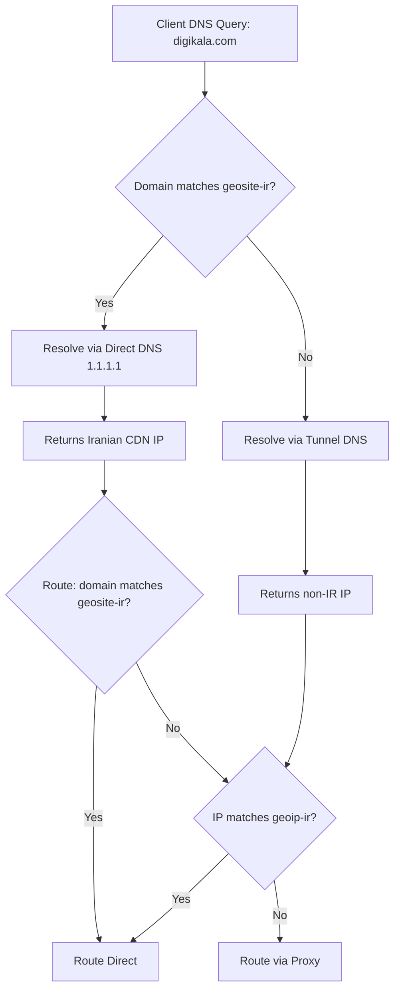

# Design Document: Domain Whitelist (Geosite)

## Overview

This feature adds domain-based whitelist routing using sing-box's `geosite` rule sets. When Iranian domains (e.g., digikala.com) are accessed, DNS resolution happens directly (not through the tunnel), returning Iranian CDN IPs. Traffic then routes directly as well. This complements the existing geoip-based IP whitelist — geosite catches domains at the DNS level, geoip catches IPs at the routing level.

The core change is in `ConfigGenerator.generateSingBox()`: the generated sing-box config gains split DNS (direct for geosite-matched domains, tunnel for everything else) and a domain-based route rule that precedes the existing geoip rule.

## Architecture



The dual-layer approach (geosite + geoip) provides belt-and-suspenders coverage:
- **Geosite** catches known Iranian domains at DNS level → direct resolution → direct routing
- **Geoip** catches any remaining traffic destined for Iranian IPs → direct routing

## Components and Interfaces

### Modified Components

#### 1. `internal/config/config.go` — WhitelistConfig

Add two new fields to `WhitelistConfig`:

```go
type WhitelistConfig struct {
    Countries        []string `yaml:"countries"`
    GeositeCountries []string `yaml:"geosite_countries,omitempty"`
    GeositeURL       string   `yaml:"geosite_url,omitempty"`
    CustomFile       string   `yaml:"custom_file,omitempty"`
    UpdateInterval   string   `yaml:"update_interval"`
}
```

- `GeositeCountries`: list of country codes for domain-based whitelisting (e.g., `["ir"]`)
- `GeositeURL`: URL template for downloading geosite `.srs` files. Default: `https://github.com/SagerNet/sing-geosite/releases/latest/download/geosite-{country}.srs`

#### 2. `internal/tunnel/configgen.go` — ConfigGenerator

Add a new field and methods:

```go
type ConfigGenerator struct {
    tempDir              string
    WhitelistCountries   []string // geoip countries
    GeositeCountries     []string // geosite countries (NEW)
    SOCKSPort            int
    SNISpoof             string
}
```

New/modified methods:
- `singboxDNS(link)` — generates the DNS section with split resolution
- `singboxRoute(link)` — modified to include geosite route rules and rule_set definitions
- `singboxGeositeRuleSets()` — returns geosite rule_set definitions

#### 3. `internal/engine/downloader.go` — Geosite Download

Extend the existing geo file download logic to also handle geosite files. The download uses the same `GeoDir` and `UpdateInterval` as geoip files.

### Sing-box Config Structure (Generated)

The generated sing-box JSON config with both geosite and geoip enabled:

```json
{
  "dns": {
    "servers": [
      {"tag": "dns-direct", "address": "udp://1.1.1.1"},
      {"tag": "dns-tunnel", "address": "udp://1.1.1.1", "detour": "proxy"}
    ],
    "rules": [
      {"rule_set": ["geosite-ir"], "server": "dns-direct"},
    ],
    "final": "dns-tunnel"
  },
  "route": {
    "rules": [
      {"action": "sniff", "timeout": "300ms"},
      {"action": "resolve", "server": "dns-direct"},
      {"ip_is_private": true, "action": "route", "outbound": "direct"},
      {"rule_set": ["geosite-ir"], "action": "route", "outbound": "direct"},
      {"rule_set": ["geoip-ir"], "action": "route", "outbound": "direct"}
    ],
    "rule_set": [
      {"type": "local", "tag": "geosite-ir", "format": "binary", "path": "/etc/bypath/geo/geosite-ir.srs"},
      {"type": "local", "tag": "geoip-ir", "format": "binary", "path": "/etc/bypath/geo/geoip-ir.srs"}
    ],
    "final": "proxy"
  }
}
```

Key design decisions:
1. **DNS split**: `dns-direct` resolves without tunnel, `dns-tunnel` resolves through proxy. Geosite-matched domains use direct; everything else uses tunnel.
2. **Route ordering**: geosite rule comes before geoip rule. Domain match is checked first (faster, no IP resolution needed for the match itself).
3. **Rule set type**: `local` — files are pre-downloaded to `GeoDir`, not fetched at runtime by sing-box.

## Data Models

### Configuration YAML

```yaml
whitelist:
  countries: ["ir"]                    # existing geoip whitelist
  geosite_countries: ["ir"]            # NEW: domain-based whitelist
  geosite_url: ""                      # NEW: custom URL (empty = default)
  update_interval: "24h"
```

### File Layout

```
/etc/bypath/geo/          (or ./data/geo/ in local mode)
├── geoip-ir.srs          (existing)
└── geosite-ir.srs        (NEW)
```

### URL Template

Default: `https://github.com/SagerNet/sing-geosite/releases/latest/download/geosite-{country}.srs`

The `{country}` placeholder is replaced with the country code at download time.

## Correctness Properties

*A property is a characteristic or behavior that should hold true across all valid executions of a system — essentially, a formal statement about what the system should do. Properties serve as the bridge between human-readable specifications and machine-verifiable correctness guarantees.*

### Property 1: Config serialization round-trip preserves geosite fields

*For any* valid `WhitelistConfig` with arbitrary `GeositeCountries` list and `GeositeURL` string, serializing to YAML and deserializing back SHALL produce an equivalent struct.

**Validates: Requirements 1.1, 1.2**

### Property 2: DNS rules reference geosite rule sets for direct resolution

*For any* non-empty `GeositeCountries` list and any valid `Link`, the generated sing-box config SHALL contain a DNS section where: (a) a `dns-direct` server exists without a detour, (b) a `dns-tunnel` server exists with detour through proxy, (c) for each geosite country there is a DNS rule referencing `geosite-{country}` pointing to `dns-direct`, and (d) the final DNS server is `dns-tunnel`.

**Validates: Requirements 2.1, 2.2, 2.3, 2.4**

### Property 3: Route rules contain geosite rule with correct ordering and definition

*For any* non-empty `GeositeCountries` list combined with any `WhitelistCountries` list, the generated route section SHALL contain: (a) a route rule with `rule_set` referencing `geosite-{country}` tags routing to `direct`, (b) this rule appears before any `geoip-{country}` route rule, and (c) the `rule_set` definitions include entries with type `local`, format `binary`, and path `GeoDir/geosite-{country}.srs`.

**Validates: Requirements 3.1, 3.2, 3.3, 1.5**

### Property 4: Geosite and geoip coexistence produces correct combined config

*For any* combination of `GeositeCountries` and `WhitelistCountries` (including one or both being empty), the generated sing-box config SHALL: (a) include geosite rules if and only if `GeositeCountries` is non-empty, (b) include geoip rules if and only if `WhitelistCountries` is non-empty, (c) include DNS split if and only if `GeositeCountries` is non-empty, and (d) always produce valid JSON.

**Validates: Requirements 4.1, 4.2, 4.3, 4.4**

## Error Handling

| Scenario | Behavior |
|----------|----------|
| Geosite file missing + download succeeds | Normal operation, file saved to GeoDir |
| Geosite file missing + download fails | Log error, omit geosite rules from config, continue with geoip-only |
| Geosite file exists + download fails on update | Log warning, use existing file |
| Invalid country code in config | Treated as-is (sing-box will fail to load the rule_set file — logged by sing-box) |
| Empty `geosite_countries` | Feature disabled, no geosite rules generated, identical to current behavior |
| `geosite_url` with invalid template | Download will fail, handled same as download failure |

## Testing Strategy

### Property-Based Tests (using `pgregory.net/rapid`)

Each correctness property maps to a property-based test with minimum 100 iterations:

1. **Config round-trip** — Generate random WhitelistConfig, serialize/deserialize, assert equality
2. **DNS rules structure** — Generate random GeositeCountries + Link, generate config, assert DNS structure
3. **Route rules ordering** — Generate random GeositeCountries + WhitelistCountries + Link, assert geosite before geoip
4. **Coexistence matrix** — Generate random combinations (both, geosite-only, geoip-only, neither), assert correct presence/absence

### Unit Tests

- Default values applied when fields omitted
- Specific config examples (IR geosite + IR geoip)
- Edge cases: empty country list, single country, multiple countries
- Download URL template expansion

### Integration Tests

- Geosite file download from GitHub (mocked HTTP)
- Update interval triggering re-download
- Graceful degradation on download failure
