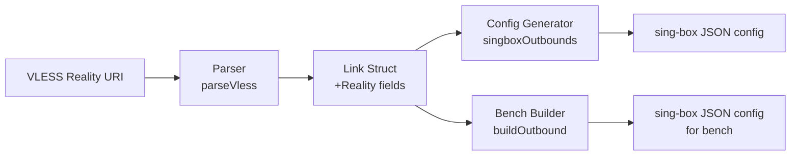

# Design Document: VLESS Reality Support

## Overview

This feature adds VLESS Reality protocol support to Bypath's link parsing and config generation pipeline. Reality is a TLS-based censorship evasion technique that requires three additional parameters beyond standard TLS: a server public key (`pbk`), a short ID (`sid`), and a UTLS browser fingerprint (`fp`). The implementation touches three layers: the data model (Link struct), the URI parser, and both config generators (configgen.go and main.go's buildOutbound).

The change is additive — new fields with `omitempty` JSON tags ensure backward compatibility with existing saved profiles.

## Architecture

The data flow is linear and straightforward:



No new packages or dependencies are introduced. The change is confined to:
- `internal/profile/profile.go` — struct fields
- `internal/profile/parser.go` — parameter extraction
- `internal/tunnel/configgen.go` — sing-box TLS object construction
- `cmd/bypath/main.go` — bench builder TLS object construction

## Components and Interfaces

### Link Struct Changes (profile.go)

Three new fields are added to the `Link` struct:

```go
// Reality/UTLS fields (populated from VLESS Reality URIs)
RealityPublicKey string `json:"reality_pbk,omitempty"`  // pbk param
RealityShortID   string `json:"reality_sid,omitempty"`  // sid param
Fingerprint      string `json:"fingerprint,omitempty"`  // fp param (UTLS)
```

These fields are placed after the existing `Flow` field, grouped with a comment indicating their purpose.

### Parser Changes (parser.go)

In `parseVless()`, after the existing parameter extraction block, three additional `params.Get()` calls extract Reality parameters:

```go
link.RealityPublicKey = params.Get("pbk")
link.RealityShortID = params.Get("sid")
link.Fingerprint = params.Get("fp")
```

No validation is performed on the values — they are stored as-is from the URI. This matches the existing parser pattern (e.g., `Flow` is stored without validation).

### Config Generator Changes (configgen.go)

The `singboxOutbounds()` method's `case "vless"` TLS block is restructured:

```go
if link.TLS {
    tls := map[string]interface{}{"enabled": true}
    if sni != "" {
        tls["server_name"] = sni
    }

    if link.Security == "reality" {
        // Reality-specific TLS config
        reality := map[string]interface{}{"enabled": true}
        if link.RealityPublicKey != "" {
            reality["public_key"] = link.RealityPublicKey
        }
        if link.RealityShortID != "" {
            reality["short_id"] = link.RealityShortID
        }
        tls["reality"] = reality
    } else {
        tls["insecure"] = true
    }

    if link.Fingerprint != "" {
        tls["utls"] = map[string]interface{}{
            "enabled":     true,
            "fingerprint": link.Fingerprint,
        }
    }

    outbound["tls"] = tls
}
```

Key design decisions:
- `insecure: true` is only set for non-Reality TLS (Reality doesn't need it since it uses its own verification)
- `utls` is set for any link with a fingerprint, not just Reality (some TLS links also use UTLS)
- The `reality` sub-object is only included when `Security == "reality"`

### Bench Builder Changes (main.go)

The `buildOutbound()` function's VLESS Reality branch is updated to include `public_key`, `short_id`, and `utls`:

```go
if link.Security == "reality" {
    ob += `,"tls":{"enabled":true`
    if sni != "" {
        ob += fmt.Sprintf(`,"server_name":"%s"`, sni)
    }
    ob += `,"reality":{"enabled":true`
    if link.RealityPublicKey != "" {
        ob += fmt.Sprintf(`,"public_key":"%s"`, link.RealityPublicKey)
    }
    if link.RealityShortID != "" {
        ob += fmt.Sprintf(`,"short_id":"%s"`, link.RealityShortID)
    }
    ob += "}"
    if link.Fingerprint != "" {
        ob += fmt.Sprintf(`,"utls":{"enabled":true,"fingerprint":"%s"}`, link.Fingerprint)
    }
    ob += "}"
}
```

## Data Models

### Link Struct (updated)

```go
type Link struct {
    Remark     string `json:"remark"`
    Protocol   string `json:"protocol"`
    RawURI     string `json:"raw_uri"`
    Group      string `json:"group"`

    Address    string `json:"address"`
    Port       int    `json:"port"`
    UUID       string `json:"uuid,omitempty"`
    AlterId    int    `json:"alter_id,omitempty"`
    Security   string `json:"security,omitempty"`
    Network    string `json:"network,omitempty"`
    TLS        bool   `json:"tls,omitempty"`
    SNI        string `json:"sni,omitempty"`
    Path       string `json:"path,omitempty"`
    Host       string `json:"host,omitempty"`
    Flow       string `json:"flow,omitempty"`

    // Reality/UTLS fields
    RealityPublicKey string `json:"reality_pbk,omitempty"`
    RealityShortID   string `json:"reality_sid,omitempty"`
    Fingerprint      string `json:"fingerprint,omitempty"`

    // WireGuard fields
    PublicKey  string `json:"public_key,omitempty"`
    PrivateKey string `json:"private_key,omitempty"`
    Endpoint   string `json:"endpoint,omitempty"`

    // Chain support
    ChainProxy string `json:"-"`
    ListenPort int    `json:"-"`
}
```

### sing-box TLS Output (Reality case)

```json
{
  "tls": {
    "enabled": true,
    "server_name": "example.com",
    "reality": {
      "enabled": true,
      "public_key": "PUBLIC_KEY_VALUE",
      "short_id": "SHORT_ID_VALUE"
    },
    "utls": {
      "enabled": true,
      "fingerprint": "chrome"
    }
  }
}
```

### sing-box TLS Output (standard TLS case, unchanged)

```json
{
  "tls": {
    "enabled": true,
    "server_name": "example.com",
    "insecure": true
  }
}
```

## Correctness Properties

*A property is a characteristic or behavior that should hold true across all valid executions of a system — essentially, a formal statement about what the system should do. Properties serve as the bridge between human-readable specifications and machine-verifiable correctness guarantees.*

### Property 1: Reality parameter round-trip preservation

*For any* valid VLESS Reality URI containing `pbk`, `sid`, and `fp` parameters, parsing the URI into a Link struct SHALL produce `RealityPublicKey`, `RealityShortID`, and `Fingerprint` values identical to the original URI query parameter values.

**Validates: Requirements 2.1, 2.2, 2.3, 2.6**

### Property 2: Reality config structure validity

*For any* Link with `Security == "reality"` and non-empty `RealityPublicKey`, the generated sing-box config SHALL contain a `tls` object with `reality.enabled == true`, `reality.public_key` matching the Link's `RealityPublicKey`, and SHALL NOT contain `insecure`.

**Validates: Requirements 3.1, 3.4, 3.5**

### Property 3: UTLS fingerprint inclusion

*For any* Link with a non-empty `Fingerprint` field, the generated sing-box config SHALL contain `tls.utls.enabled == true` and `tls.utls.fingerprint` matching the Link's `Fingerprint` value.

**Validates: Requirements 3.3**

### Property 4: Non-Reality TLS backward compatibility

*For any* Link with `TLS == true` and `Security != "reality"`, the generated sing-box config SHALL contain `tls.insecure == true` and SHALL NOT contain a `reality` sub-object.

**Validates: Requirements 5.1**

### Property 5: Config generator and bench builder equivalence

*For any* Link with `Security == "reality"`, the TLS object produced by the Config_Generator and the TLS object produced by the Bench_Builder SHALL be structurally equivalent (same keys and values).

**Validates: Requirements 4.3**

## Error Handling

This feature introduces no new error conditions. The parser follows the existing pattern of graceful degradation:

- Missing `pbk`/`sid`/`fp` parameters result in empty strings (no error)
- The config generator checks for non-empty values before including them in output
- Invalid or malformed parameter values are stored as-is (validation is the server's responsibility)
- Existing JSON profiles without Reality fields deserialize cleanly due to `omitempty` tags

## Testing Strategy

### Unit Tests (example-based)

- Parse a complete Reality URI and verify all fields are populated
- Parse a Reality URI missing `sid` and verify partial extraction works
- Parse a non-Reality VLESS URI and verify Reality fields remain empty
- Generate sing-box config for a Reality link and validate JSON structure
- Generate sing-box config for a standard TLS link and verify no Reality keys present
- Deserialize a legacy JSON profile (no Reality fields) and verify no errors

### Property-Based Tests

Property-based testing is appropriate here because:
- The parser is a pure function with clear input/output behavior
- The config generator transforms structured data deterministically
- Input space is large (arbitrary strings for pbk, sid, fp, sni)
- Round-trip and invariant properties are natural fits

**Library**: `pgregory.net/rapid` (Go property-based testing library, well-maintained, good generator support)

**Configuration**: Minimum 100 iterations per property test.

**Tag format**: `Feature: reality-support, Property N: <property text>`

Each correctness property from the design maps to a single property-based test:
- Property 1 → Generate random valid VLESS Reality URIs, parse, verify field preservation
- Property 2 → Generate random Links with Reality security, generate config, verify structure
- Property 3 → Generate random Links with fingerprint, generate config, verify UTLS presence
- Property 4 → Generate random Links with standard TLS, generate config, verify no Reality keys
- Property 5 → Generate random Reality Links, run both generators, compare TLS objects
