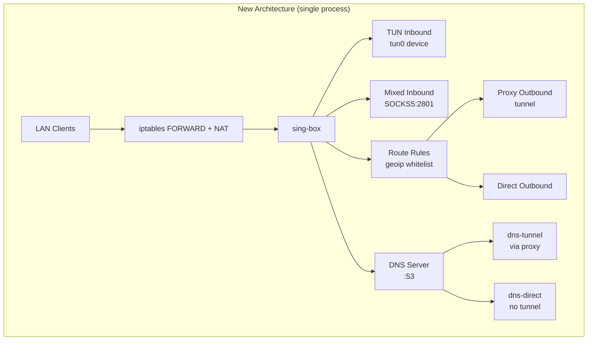
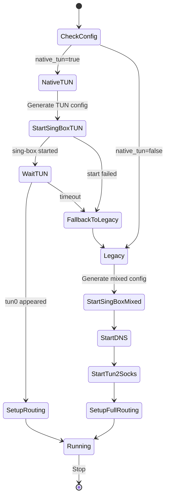

# Design Document: sing-box Native TUN Inbound

## Overview

This feature replaces the 3-process gateway architecture (sing-box + tun2socks + dns2socks) with a single sing-box process that handles TUN device creation, DNS resolution, and traffic routing natively. The change is isolated to two packages: `internal/tunnel` (config generation) and `internal/gateway` (orchestration).

**Current flow:**
```
LAN clients → iptables → tun0 → tun2socks → SOCKS5:2801 → sing-box → internet
                                  dns2socks → SOCKS5:2801 → sing-box → DNS
```

**New flow:**
```
LAN clients → iptables → tun0 (sing-box) → sing-box routing → internet
                          sing-box DNS → tunnel/direct based on rules
```

## Architecture



The gateway orchestrator's responsibility changes from managing 3 processes to:
1. Generating a sing-box config with TUN + DNS + routing
2. Starting a single sing-box process
3. Waiting for the TUN device to appear
4. Configuring iptables (forwarding + NAT only, no policy routing)

## Components and Interfaces

### ConfigGenerator Changes (`internal/tunnel/configgen.go`)

The `ConfigGenerator` struct gains a new field:

```go
type ConfigGenerator struct {
    tempDir            string
    WhitelistCountries []string
    SOCKSPort          int
    SNISpoof           string
    GatewayMode        bool   // NEW: when true, generate TUN inbound + DNS
    DNSPort            int    // NEW: DNS listen port (default 53)
}
```

New methods:

```go
// singboxInboundsGateway returns [TUN inbound, Mixed inbound] for gateway mode
func (cg *ConfigGenerator) singboxInboundsGateway(link *profile.Link) []map[string]interface{}

// singboxDNS returns the DNS configuration section for gateway mode
func (cg *ConfigGenerator) singboxDNS() map[string]interface{}
```

The existing `singboxInbounds` method remains unchanged for proxy-only mode. The `generateSingBox` method checks `GatewayMode` to decide which inbound generator to call.

### Gateway Orchestrator Changes (`internal/gateway/gateway.go`)

New fields on `Gateway`:

```go
type Gateway struct {
    // ... existing fields ...
    nativeTUN bool // whether sing-box native TUN is active
}
```

Modified flow in `Start()`:

```go
func (gw *Gateway) Start() error {
    // 1. Detect network (unchanged)
    // 2. Get active link (unchanged)
    // 3. Start engine — now with GatewayMode=true in config generator
    // 4. If native TUN:
    //    - Skip startDNS() (sing-box handles it)
    //    - Skip startTun() (sing-box handles it)
    //    - Wait for tun0 to appear
    //    - Setup simplified routing (no fwmark/policy routing)
    // 5. If fallback (native TUN failed or disabled):
    //    - Regenerate config without TUN
    //    - Start dns2socks + tun2socks (legacy path)
    //    - Setup full routing (fwmark + policy routing)
}
```

### Config Changes (`internal/config/config.go`)

```go
type GatewayConfig struct {
    Enabled     bool     `yaml:"enabled"`
    Interface   string   `yaml:"interface"`
    DNSUpstream []string `yaml:"dns_upstream"`
    NativeTUN   bool     `yaml:"native_tun"` // NEW: default true
}
```

### Generated sing-box Config Structure (Gateway Mode)

```json
{
  "log": { "level": "info" },
  "inbounds": [
    {
      "type": "tun",
      "tag": "tun-in",
      "inet4_address": "10.0.0.1/30",
      "auto_route": true,
      "stack": "system",
      "sniff": true
    },
    {
      "type": "mixed",
      "tag": "mixed-in",
      "listen": "0.0.0.0",
      "listen_port": 2801
    }
  ],
  "outbounds": [
    { "type": "vless", "tag": "proxy", "..." : "..." },
    { "type": "direct", "tag": "direct" }
  ],
  "route": {
    "rules": [
      { "action": "sniff", "timeout": "300ms" },
      { "action": "resolve", "server": "dns-direct" },
      { "ip_is_private": true, "action": "route", "outbound": "direct" },
      { "rule_set": ["geoip-ir"], "action": "route", "outbound": "direct" }
    ],
    "rule_set": [
      { "type": "local", "tag": "geoip-ir", "format": "binary", "path": "..." }
    ],
    "final": "proxy"
  },
  "dns": {
    "servers": [
      { "tag": "dns-tunnel", "address": "udp://1.1.1.1", "detour": "proxy" },
      { "tag": "dns-direct", "address": "udp://1.1.1.1", "detour": "direct" }
    ],
    "rules": [
      { "rule_set": ["geosite-ir"], "server": "dns-direct" }
    ],
    "final": "dns-tunnel",
    "independent_cache": true
  }
}
```

## Data Models

### TUN Inbound Configuration

| Field | Type | Value | Description |
|-------|------|-------|-------------|
| type | string | `"tun"` | Inbound type identifier |
| tag | string | `"tun-in"` | Reference tag for routing |
| inet4_address | string | `"10.0.0.1/30"` | TUN device IPv4 address |
| auto_route | bool | `true` | sing-box manages routing rules |
| stack | string | `"system"` | Network stack (system = kernel) |
| sniff | bool | `true` | Protocol sniffing for domain detection |

### DNS Configuration

| Field | Type | Description |
|-------|------|-------------|
| servers | array | DNS server definitions |
| servers[].tag | string | Server identifier (`dns-tunnel`, `dns-direct`) |
| servers[].address | string | DNS server address (e.g., `udp://1.1.1.1`) |
| servers[].detour | string | Outbound to use (`proxy` or `direct`) |
| rules | array | Domain-based DNS routing rules |
| final | string | Default DNS server tag |
| independent_cache | bool | Separate cache per server |

### Gateway State Machine



## Correctness Properties

*A property is a characteristic or behavior that should hold true across all valid executions of a system — essentially, a formal statement about what the system should do. Properties serve as the bridge between human-readable specifications and machine-verifiable correctness guarantees.*

### Property 1: Gateway mode produces both TUN and Mixed inbounds

*For any* valid Link struct, when the Config_Generator has GatewayMode enabled, the generated sing-box configuration SHALL contain exactly two inbounds: one with `type: "tun"` and one with `type: "mixed"`.

**Validates: Requirements 1.1, 1.3**

### Property 2: TUN inbound has correct constant fields

*For any* valid Link struct with GatewayMode enabled, the TUN inbound in the generated configuration SHALL have `inet4_address` equal to `"10.0.0.1/30"`, `stack` equal to `"system"`, and `auto_route` equal to `true`.

**Validates: Requirements 1.4, 1.5, 1.6**

### Property 3: Proxy-only mode produces only Mixed inbound

*For any* valid Link struct, when the Config_Generator has GatewayMode disabled, the generated sing-box configuration SHALL contain exactly one inbound with `type: "mixed"` and no inbound with `type: "tun"`.

**Validates: Requirements 1.2**

### Property 4: Gateway DNS has tunnel and direct servers with correct routing

*For any* valid Link struct with GatewayMode enabled, the generated DNS section SHALL contain at least two servers where one has `detour: "proxy"` (tunnel) and one has `detour: "direct"`.

**Validates: Requirements 2.1, 2.2, 2.3**

### Property 5: DNS rules reference whitelist countries

*For any* non-empty whitelist country list with GatewayMode enabled, the generated DNS rules SHALL contain rule_set references for each whitelisted country (as geosite entries) routing to the direct DNS server.

**Validates: Requirements 2.4**

### Property 6: DNS listen is present only in gateway mode

*For any* valid Link struct, the generated DNS section SHALL include a listen address and port when GatewayMode is enabled, and SHALL omit the listen configuration when GatewayMode is disabled.

**Validates: Requirements 2.5, 2.6**

## Error Handling

| Scenario | Handling |
|----------|----------|
| sing-box fails to start with TUN config | Retry with mixed-inbound config, fall back to legacy mode |
| TUN device doesn't appear within timeout | Log warning, fall back to legacy mode |
| tun2socks not found during fallback | Log error, operate in proxy-only mode |
| dns2socks not found during fallback | Log warning, continue without DNS proxy |
| sing-box version too old for TUN | Detected by startup failure, triggers fallback |
| iptables commands fail | Log warning, continue (non-fatal) |

The fallback chain ensures the gateway always reaches a working state:
1. Try native TUN → success → done
2. Native TUN fails → try legacy (tun2socks + dns2socks) → success → done
3. Legacy TUN fails → proxy-only mode (SOCKS5 available, no gateway routing)

## Testing Strategy

### Property-Based Tests

Property-based testing is appropriate for the config generation logic (`configgen.go`) because:
- Config generation is a pure function (Link struct + options → JSON)
- Behavior varies meaningfully with input (different protocols, ports, whitelist countries)
- Universal properties hold across all valid inputs
- Cost is low (in-memory JSON generation)

**Library:** Use `pgregory.net/rapid` (Go property-based testing library)
**Configuration:** Minimum 100 iterations per property test
**Tag format:** `Feature: singbox-tun-inbound, Property N: <title>`

### Unit Tests

- Config generation with specific protocol combinations (vmess, vless, trojan, etc.)
- Default value application for `native_tun` config field
- Edge cases: empty whitelist, zero ports, missing fields

### Integration Tests

- Gateway orchestrator start/stop with mocked process execution
- Fallback behavior when sing-box TUN fails
- Routing setup verification (commands executed vs skipped)
- Full lifecycle: start → verify → stop → cleanup
