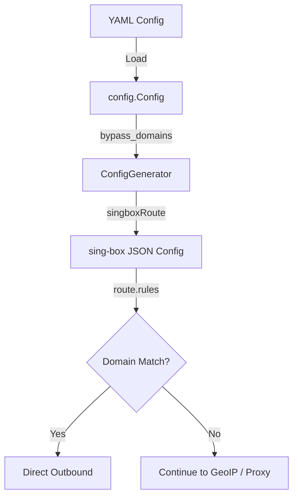

# Design Document: VPN Detection Bypass

## Overview

Mobile carrier apps detect VPN usage by querying IP geolocation endpoints (e.g., `cloudflare.com/cdn-cgi/trace`) and checking if the response indicates a non-local country. This feature adds domain-based direct routing to the sing-box configuration so that traffic to these detection endpoints always bypasses the tunnel, ensuring the response shows `loc=IR`.

The implementation touches two components:
1. **Config** (`internal/config/config.go`) — adds a `bypass_domains` field to `WhitelistConfig`
2. **ConfigGenerator** (`internal/tunnel/configgen.go`) — generates a `domain_suffix` routing rule that sends matching traffic to the "direct" outbound

## Architecture



The domain bypass rule is injected into the sing-box route rules array **before** the geoip whitelist rules. sing-box evaluates rules top-to-bottom, so domain matches take priority over IP-based country matching.

## Components and Interfaces

### Config Changes (`internal/config/config.go`)

Add `BypassDomains` field to `WhitelistConfig`:

```go
type WhitelistConfig struct {
    Countries      []string `yaml:"countries"`
    BypassDomains  []string `yaml:"bypass_domains,omitempty"`
    CustomFile     string   `yaml:"custom_file,omitempty"`
    UpdateInterval string   `yaml:"update_interval"`
}
```

Default values applied in `applyDefaults()`:

```go
if len(cfg.Whitelist.BypassDomains) == 0 {
    cfg.Whitelist.BypassDomains = []string{
        "cloudflare.com",
        "ip-api.com",
        "ipinfo.io",
        "api.myip.com",
    }
}
```

### ConfigGenerator Changes (`internal/tunnel/configgen.go`)

Add `BypassDomains` field to `ConfigGenerator`:

```go
type ConfigGenerator struct {
    tempDir            string
    WhitelistCountries []string
    BypassDomains      []string // domains to route direct (bypass tunnel)
    SOCKSPort          int
    SNISpoof           string
}
```

New method to build the domain bypass rule:

```go
func (cg *ConfigGenerator) singboxBypassDomainRule() map[string]interface{} {
    return map[string]interface{}{
        "domain_suffix": cg.BypassDomains,
        "action":        "route",
        "outbound":      "direct",
    }
}
```

Modified `singboxRoute()` inserts the domain rule after sniff/resolve but before geoip rules:

```go
func (cg *ConfigGenerator) singboxRoute(link *profile.Link) map[string]interface{} {
    var rules []map[string]interface{}

    // 1. Sniff
    rules = append(rules, map[string]interface{}{
        "action": "sniff", "timeout": "300ms",
    })

    // 2. Resolve
    rules = append(rules, map[string]interface{}{
        "action": "resolve", "server": "dns-direct",
    })

    // 3. Domain bypass (VPN detection endpoints → direct)
    if len(cg.BypassDomains) > 0 {
        rules = append(rules, cg.singboxBypassDomainRule())
    }

    // 4. Private IPs → direct
    rules = append(rules, map[string]interface{}{
        "ip_is_private": true, "action": "route", "outbound": "direct",
    })

    // 5. GeoIP whitelist → direct
    if len(cg.WhitelistCountries) > 0 {
        // ... existing geoip rule logic ...
    }

    // ...
}
```

### Modified `generateSingBox()` — Always Include Route When Bypass Domains Exist

Currently, the route section is only added when `WhitelistCountries` is non-empty. The change ensures the route section is also generated when `BypassDomains` is non-empty:

```go
if len(cg.WhitelistCountries) > 0 || len(cg.BypassDomains) > 0 {
    cfg["route"] = cg.singboxRoute(link)
    cfg["dns"] = map[string]interface{}{...}
}
```

## Data Models

### Config YAML Structure

```yaml
whitelist:
  countries: ["ir"]
  bypass_domains:
    - "cloudflare.com"
    - "ip-api.com"
    - "ipinfo.io"
    - "api.myip.com"
  update_interval: "24h"
```

### Generated sing-box Route Rule

```json
{
  "domain_suffix": ["cloudflare.com", "ip-api.com", "ipinfo.io", "api.myip.com"],
  "action": "route",
  "outbound": "direct"
}
```

sing-box's `domain_suffix` matching means `cloudflare.com` matches:
- `cloudflare.com` (exact)
- `www.cloudflare.com` (subdomain)
- `cdn-cgi.cloudflare.com` (any subdomain depth)

## Correctness Properties

*A property is a characteristic or behavior that should hold true across all valid executions of a system — essentially, a formal statement about what the system should do. Properties serve as the bridge between human-readable specifications and machine-verifiable correctness guarantees.*

### Property 1: Explicit bypass domains override defaults

*For any* non-empty list of domain strings provided in the `bypass_domains` config field, the loaded Config SHALL contain exactly those domains and none of the default domains (unless they happen to be in the provided list).

**Validates: Requirements 1.3**

### Property 2: Validation rejects empty domain entries

*For any* list of strings that contains at least one empty string, the Config validation SHALL reject the list.

**Validates: Requirements 1.4**

### Property 3: Generated config contains correct domain bypass rule

*For any* non-empty list of bypass domains (regardless of whether whitelist countries are configured), the generated sing-box config SHALL contain a route rule with `domain_suffix` matching those exact domains and routing to the "direct" outbound.

**Validates: Requirements 2.1, 2.3, 2.4**

### Property 4: Domain bypass rule precedes geoip rules

*For any* generated sing-box config that contains both domain bypass rules and geoip whitelist rules, the domain bypass rule SHALL appear at a lower index in the rules array than any geoip rule.

**Validates: Requirements 2.2**

### Property 5: Config serialization round-trip

*For any* valid Config object containing a non-empty `bypass_domains` list, serializing to YAML and then deserializing SHALL produce a Config with an identical `bypass_domains` list (same order, same content).

**Validates: Requirements 4.1, 4.2**

## Error Handling

| Scenario | Behavior |
|----------|----------|
| `bypass_domains` contains empty string | `applyDefaults` or a validation step removes empty entries and logs a warning |
| `bypass_domains` contains invalid characters | Passed through as-is (sing-box will reject at runtime if truly invalid) |
| `bypass_domains` is nil/omitted | Defaults applied (`cloudflare.com`, `ip-api.com`, `ipinfo.io`, `api.myip.com`) |
| sing-box rejects generated config | Existing error propagation from engine process start handles this |

## Testing Strategy

### Unit Tests
- Test `applyDefaults` applies default bypass domains when field is empty/nil
- Test `applyDefaults` does not override explicitly set bypass domains
- Test `singboxRoute` output structure with bypass domains only (no whitelist countries)
- Test `singboxRoute` output structure with both bypass domains and whitelist countries
- Test rule ordering (domain rule before geoip rule)
- Test `generateSingBox` includes route section when only bypass domains are set

### Property-Based Tests (using `testing/quick` or `rapid`)
- **Property 1**: Generate random domain lists, set in config, verify loaded config matches
- **Property 3**: Generate random domain lists, generate sing-box config, verify domain_suffix rule exists with correct domains
- **Property 4**: Generate random combinations of domains + countries, verify rule ordering
- **Property 5**: Generate random Config with bypass_domains, round-trip through YAML, verify equality

**PBT Library**: `pgregory.net/rapid` (Go property-based testing library)
**Minimum iterations**: 100 per property test
**Tag format**: `Feature: vpn-detection-bypass, Property N: <property text>`
