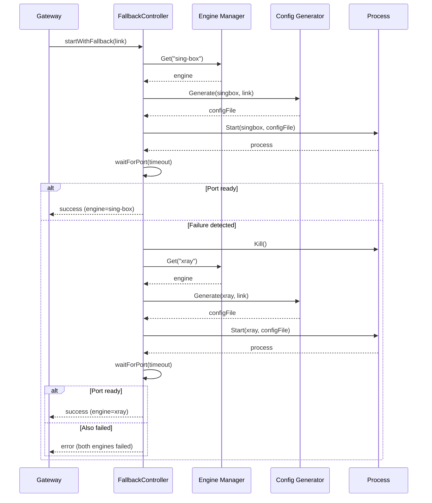

# Design Document: Xray Fallback

## Overview

This feature adds automatic engine fallback to Bypath's gateway orchestration. When the primary engine (typically sing-box) fails to start — either by crashing immediately or by not opening its SOCKS port in time — the system automatically attempts to start xray as a fallback. The fallback is transparent to LAN clients and integrates with the existing tun2socks-based gateway mode.

The design extends three existing components:
1. **Gateway** (`gateway.go`) — adds fallback logic to `startEngine`
2. **ConfigGenerator** (`configgen.go`) — extends xray config generation to cover all supported protocols with full transport/TLS mapping
3. **Config** (`config.go`) — adds `engines.fallback` configuration section

## Architecture



## Components and Interfaces

### FallbackController (new — `internal/engine/fallback.go`)

Encapsulates the fallback logic, keeping it separate from the gateway orchestration.

```go
// FallbackConfig holds fallback-specific settings.
type FallbackConfig struct {
    Enabled bool
    Timeout time.Duration
    Order   []string // e.g. ["sing-box", "xray"]
}

// FallbackResult contains the outcome of a fallback-aware engine start.
type FallbackResult struct {
    Engine      *Engine
    Process     *exec.Cmd
    ConfigFile  string
    EngineName  string
    WasFallback bool
    Attempts    []AttemptRecord
}

// AttemptRecord logs a single engine start attempt.
type AttemptRecord struct {
    EngineName string
    Error      error
    Duration   time.Duration
}

// FallbackController manages engine startup with automatic fallback.
type FallbackController struct {
    engineMgr  *Manager
    configGen  ConfigGeneratorInterface
    config     FallbackConfig
    socksPort  int
}

// StartWithFallback tries engines in order until one succeeds.
func (fc *FallbackController) StartWithFallback(ctx context.Context, link *profile.Link) (*FallbackResult, error)
```

### ConfigGenerator Extensions (`internal/tunnel/configgen.go`)

The existing `generateXray` method is extended to support all protocols that xray handles (vmess, vless, trojan, shadowsocks) with full transport and TLS settings.

```go
// Extended xray generation — already partially exists, needs:
// - Trojan protocol support
// - Shadowsocks protocol support  
// - Reality TLS settings
// - gRPC transport
// - HTTP/2 transport
// - ALPN configuration
// - Fingerprint (uTLS) settings
func (cg *ConfigGenerator) generateXray(link *profile.Link) (string, error)
func (cg *ConfigGenerator) xrayOutbounds(link *profile.Link) []map[string]interface{}
func (cg *ConfigGenerator) xrayStreamSettings(link *profile.Link) map[string]interface{}
```

### Config Extensions (`internal/config/config.go`)

```go
type EnginesConfig struct {
    Directory       string         `yaml:"directory"`
    PreferSystem    bool           `yaml:"prefer_system"`
    PreferredEngine string         `yaml:"preferred,omitempty"`
    Fallback        FallbackConfig `yaml:"fallback"`
}

type FallbackConfig struct {
    Enabled bool     `yaml:"enabled"`
    Timeout string   `yaml:"timeout"` // duration string, e.g. "10s"
    Order   []string `yaml:"order"`   // e.g. ["sing-box", "xray"]
}
```

### Gateway Modifications (`internal/gateway/gateway.go`)

The `startEngine` method is refactored to delegate to `FallbackController.StartWithFallback`. The gateway stores the active engine name for status reporting.

```go
type Gateway struct {
    // ... existing fields ...
    activeEngine string // "sing-box" or "xray" — for status API
    fallbackCtrl *engine.FallbackController
}
```

## Data Models

### FallbackConfig (YAML)

```yaml
engines:
  directory: "./engines"
  prefer_system: true
  preferred: ""
  fallback:
    enabled: true
    timeout: "10s"
    order: ["sing-box", "xray"]
```

### Xray Config JSON (generated)

Full xray config structure for a VLESS+Reality link:

```json
{
  "log": { "loglevel": "warning" },
  "inbounds": [{
    "port": 2801,
    "listen": "0.0.0.0",
    "protocol": "socks",
    "settings": { "auth": "noauth", "udp": true }
  }],
  "outbounds": [{
    "protocol": "vless",
    "tag": "proxy",
    "settings": {
      "vnext": [{
        "address": "server.example.com",
        "port": 443,
        "users": [{
          "id": "uuid-here",
          "encryption": "none",
          "flow": "xtls-rprx-vision"
        }]
      }]
    },
    "streamSettings": {
      "network": "tcp",
      "security": "reality",
      "realitySettings": {
        "serverName": "www.google.com",
        "fingerprint": "chrome",
        "publicKey": "base64-key",
        "shortId": "abcdef"
      }
    }
  }, {
    "protocol": "freedom",
    "tag": "direct",
    "settings": {}
  }]
}
```

### AttemptRecord (internal)

```go
type AttemptRecord struct {
    EngineName string        // "sing-box" or "xray"
    Error      error         // nil if successful
    Duration   time.Duration // how long the attempt took
}
```

## Correctness Properties

*A property is a characteristic or behavior that should hold true across all valid executions of a system — essentially, a formal statement about what the system should do. Properties serve as the bridge between human-readable specifications and machine-verifiable correctness guarantees.*

### Property 1: Failure classification by timing threshold

*For any* engine start attempt where the process exits before the configured timeout OR the SOCKS port does not become ready within the timeout, the FallbackController SHALL classify the attempt as a failure. Conversely, for any attempt where the port becomes ready within the timeout, it SHALL be classified as success.

**Validates: Requirements 1.1, 1.2**

### Property 2: Fallback initiation when alternative engine is available

*For any* Link and any Engine_Failure of the primary engine, if an alternative engine exists in the fallback order and fallback is enabled, the FallbackController SHALL attempt to start the next engine in the order.

**Validates: Requirements 2.1**

### Property 3: Xray config generation produces valid config for supported protocols

*For any* valid Link with protocol in {vmess, vless, trojan, shadowsocks}, the Config_Generator SHALL produce a valid JSON object containing the correct xray protocol field, a SOCKS inbound, and outbound settings matching the Link's address, port, and credentials.

**Validates: Requirements 3.1, 3.2**

### Property 4: Unsupported protocols produce errors

*For any* Link with a protocol not in {vmess, vless, trojan, shadowsocks, socks5, http}, the Config_Generator's xray generation SHALL return a non-nil error.

**Validates: Requirements 3.3**

### Property 5: Stream settings mapping preserves transport and TLS configuration

*For any* Link with transport settings (network, path, host) and/or TLS settings (SNI, Reality public key, fingerprint), the generated xray streamSettings SHALL contain the equivalent fields with matching values.

**Validates: Requirements 3.4, 3.5**

### Property 6: Port consistency across engines

*For any* Link, the SOCKS listen port in the generated xray config SHALL equal the SOCKS listen port in the generated sing-box config.

**Validates: Requirements 4.3**

### Property 7: Fallback order respects preferred engine

*For any* `engines.preferred` value that names a valid engine, the fallback order used by the FallbackController SHALL start with that engine and try remaining engines from the `fallback.order` list excluding the preferred engine.

**Validates: Requirements 6.3**

## Error Handling

| Scenario | Behavior |
|----------|----------|
| Primary engine binary not found | Skip to next engine in fallback order; if none available, return error |
| Config generation fails for primary | Skip to next engine; if config gen also fails for fallback, return error |
| Primary engine starts but port never ready | Kill process, log timeout, try next engine |
| Primary engine crashes immediately | Log exit code/signal, try next engine |
| All engines in fallback order fail | Return aggregated error with all AttemptRecords |
| Fallback disabled + primary fails | Return primary failure error immediately |
| Unsupported protocol for fallback engine | Skip that engine, try next; if none support it, return error |
| tun2socks not available in gateway mode | Log warning, fall back to proxy-only mode (existing behavior) |

Error messages use the existing emoji-prefix convention:
- `❌ sing-box failed: <reason>` 
- `🔄 Falling back to xray...`
- `✅ xray running on :<port> (fallback from sing-box)`
- `❌ All engines failed for link '<remark>'`

## Testing Strategy

### Property-Based Tests

Property-based testing is appropriate for this feature because:
- Config generation is a pure function (Link → JSON) with a large input space
- Failure classification is threshold-based logic with continuous input (time)
- Fallback order logic is deterministic given configuration

**Library**: `github.com/leanovate/gopter` (Go property-based testing)
**Iterations**: Minimum 100 per property

Each property test is tagged with:
```
// Feature: xray-fallback, Property N: <property text>
```

### Unit Tests

- Config defaults (fallback.enabled=true, timeout=10s, order=["sing-box","xray"])
- Fallback disabled skips fallback
- Both engines fail returns aggregated error
- Xray not available logs clear message
- Log output contains engine name and duration
- Status API returns active engine name

### Integration Tests

- Start gateway with sing-box unavailable, verify xray starts
- Start gateway with both engines, kill sing-box mid-run (future: health-check restart)
- Verify tun2socks receives correct SOCKS port when xray is active

